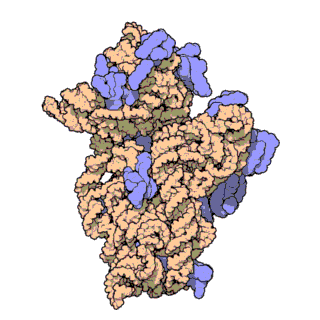
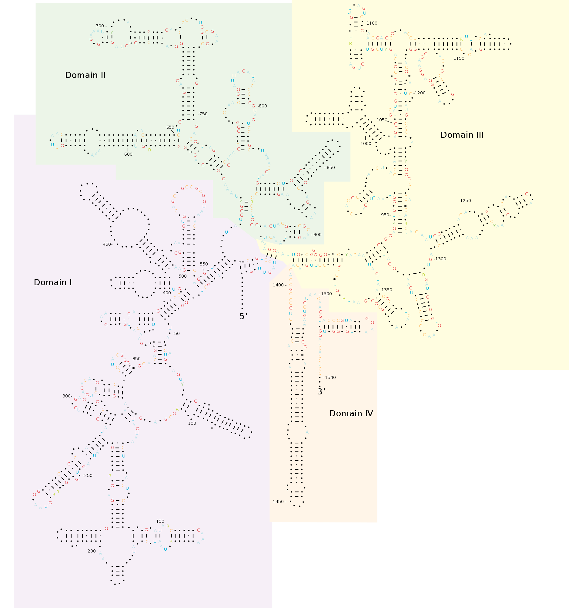
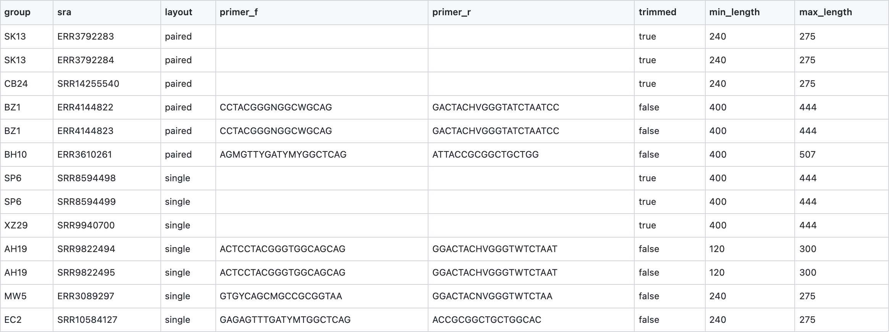

<div align="center">
  
  <h1>
      16SMaRT
  </h1>
  <h4>16s rRNA Sequencing Meta-analysis Reconstruction Tool</h4>
</div>

# Introduction

<div align="justify">

A vast majority of environmental microbiologists claim that only less than 2% of all bacteria in the environment can be cultured within laboratory conditions. Such a vast divide of being unable to culture a vast majority of bacteria in the environment might be due to lack of culturing techniques, need for specific nutrients that are unable to produce within laboratory conditions, or dependence on interactions with other bacteria in order to live and grow.

***Metagenomics*** is the study of genetic material (or genomes) extracted directly from all environmental samples. Such studies are in contrast with a traditional reduction-based approach in microbiology wherein a specific strain in consideration is isolated, purified and eventually its genome sequenced. Metagenomics helps us understand the ecology of the bacteria living within it, analyse them in their natural state and finally, understand the importance in human as well as animal health

**16s rRNA** is the most common structural-based metagenomics experimentone can conduct for an observed community of bacteria. 16s rRNA-based experiments helps one perform a general survey of ***"what kinds of bacteria are available within the community and by how much?"***. One of the key advantage of considering a 16s rRNA-based experiment is that such a region is universally conserved amongst almost all bacteria yet has enough variability to distinguish various populations across various samples.

<div align="center">

| Molecule of a 30S Subunit from thermus thermophilus | 16S ribosomal RNA |
|---------------------------------------|-------------------|
|  |  |

***Source:*** [Wikipedia](https://en.wikipedia.org/wiki/Thermus_thermophilus)

</div>

</div>

# Table of Contents

* [Input Data](#input-data)
    * [CSV DataSheet](#csv-datasheet)
* [Quality Control](#quality-control)
* [Preprocessing](#preprocessing)
* [Analysis](#analysis)

# Input Data

The input data can be passed to **16SMaRT** in two different ways using the `input` argument, either:

* a comma-seperated datasheet containing [NCBI SRA](https://www.ncbi.nlm.nih.gov/sra) IDs (or a URL to a CSV file).
* a directory containing a list of FASTQ files.

## CSV DataSheet

The CSV DataSheet must be of the following format.

| Column       | Description |
|--------------|-------------|
| `group`      | A group of FASTQ files (or a study).
| `sra`        | [NCBI SRA](https://www.ncbi.nlm.nih.gov/sra) ID
| `layout`     | Single-End or Paired-End Sequence (values: `single`, `paired`)
| `primer_f`   | Forward Primer
| `primer_r`   | Reverse Primer
| `trimmed`    | whether this sequence has already been trimmed or not. (values: `true`, `false`)
| `min_length` | start length used to screen a sequence.
| `max_length` | end length used to screen a sequence.

Take a look at a [sample.csv](https://github.com/achillesrasquinha/16SMaRT/blob/develop/src/s3mart/data/sample.csv) used in our sample pipeline.



You can then provide the parameter as follows:

```
input=/work/input.csv
```

or 

```
input="<YOUR_URL_TO_CSV_FILE>"
```

Each SRA ID is then fetched and saved onto disk within your data directory.

# Quality Control

**16SMaRT** uses [FASTQC](https://www.bioinformatics.babraham.ac.uk/projects/fastqc/) and [MultiQC](https://multiqc.info/) for Quality Control. By default, this is done right after reading FASTQ files. Quality Control can be disabled by simply providing the parameter as follows:

```
fastqc=False; multiqc=False
```

# Preprocessing

| Key       | Type  | Default 
|-----------|-------|--------
|           |       |          

# Analysis