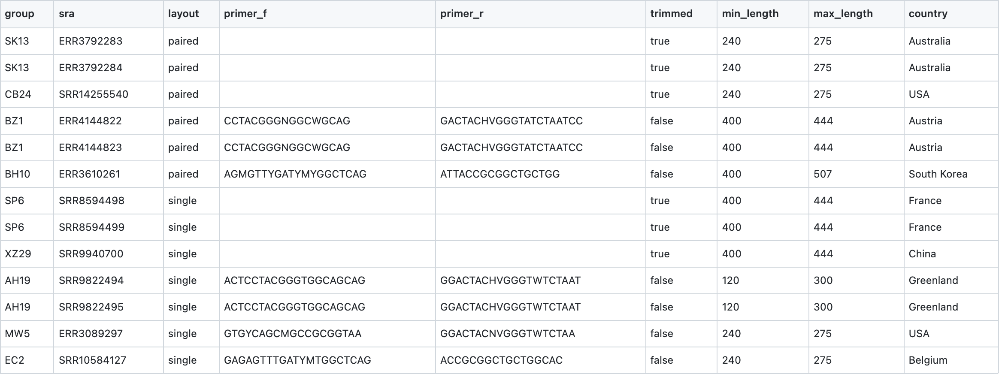

# Usage

## Table of Contents
* [Input Data](#input-data)
    * [CSV DataSheet](#csv-datasheet)
* [Quality Control](#quality-control)

## Input Data

The input data can be passed to **16SMaRT** in two different ways using the `input` argument, either:

* a comma-seperated datasheet containing [NCBI SRA](https://www.ncbi.nlm.nih.gov/sra) IDs (or a URL to a CSV file).
* a directory containing a list of FASTQ files.

### CSV DataSheet

The CSV DataSheet must be of the following format.

| Column       | Description |
|--------------|-------------|
| `group`      | A group of FASTQ files (or a study).
| `sra`        | [NCBI SRA](https://www.ncbi.nlm.nih.gov/sra) ID
| `layout`     | Single-End or Paired-End Sequence (values: `single`, `paired`)
| `primer_f`   | Forward Primer
| `primer_r`   | Reverse Primer
| `trimmed`    | whether this sequence has already been trimmed or not. (values: `true`, `false`)
| `min_length` | start length used to screen a sequence.
| `max_length` | end length used to screen a sequence.

Take a look at a [sample.csv](https://github.com/achillesrasquinha/16SMaRT/blob/develop/src/s3mart/data/sample.csv) used in the pipeline.



You can then provide the parameter as follows:

```
input=/work/input.csv
```

### Command: Fetching Data

```
docker run \
    --rm -it \
    -v "<HOST_MACHINE_PATH_DATA>:/data" \
    -v "<HOST_MACHINE_PATH_CONFIG>:/root/.config/s3mart \
    -v "<HOST_MACHINE_PATH_WORKSPACE>:/work \
    ghcr.io/achillesrasquinha/s3mart \
    bpyutils --method s3mart.data.get_data -p "data_dir=/data; input=/work/input.csv" --verbose
```

## Quality Control

**16SMaRT** uses [FASTQC](https://www.bioinformatics.babraham.ac.uk/projects/fastqc/) and [MultiQC](https://multiqc.info/) for Quality Control. By default, this is done right after reading FASTQ files.

Quality Control can be disabled by simply providing the parameter as follows:

```
fastqc=False; multiqc=False
```